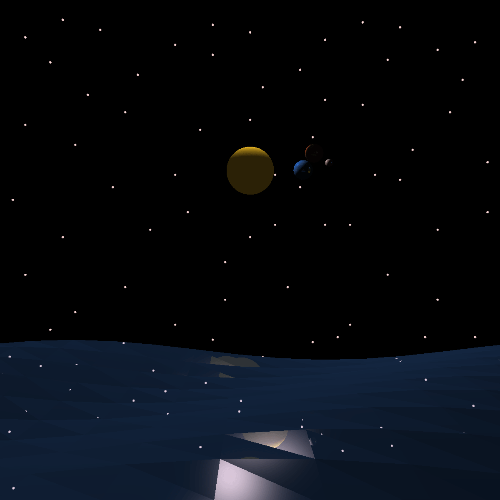

# CPSC 453 W26 Bonus Raytracing

## Features
- Implementation of a basic raytracing engine, handling reflections and local phong calculations.
- Generates a basic scene frame-by-frame
- Visual representation of a small solar system (without textures), and a reflective water-like texture.
## Images



## Build instructions
Built on arch linux using cmake. Create a directory called `build` or something similar, then use cmake to build:

```bash
mkdir build
cd build
cmake ..
make
./453-skeleton
```
After running, the output files will have to be combined into a single output gif. This can be done with `ffmpeg`:
```bash
ffmpeg -framerate 24 -i %d.png -vf "split[s0][s1];[s0]palettegen[p];[s1][p]paletteuse" output.gif
```

